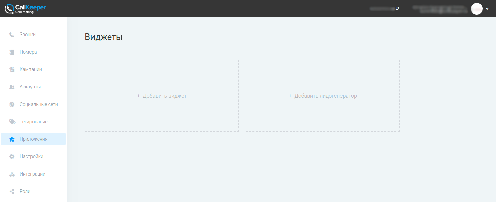
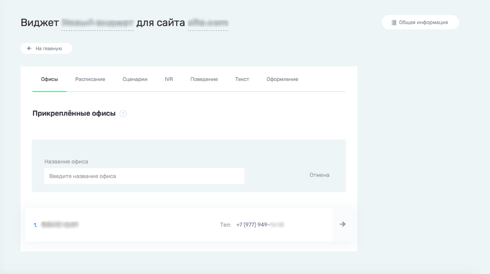
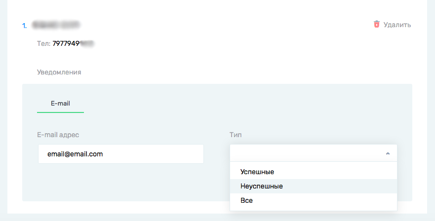
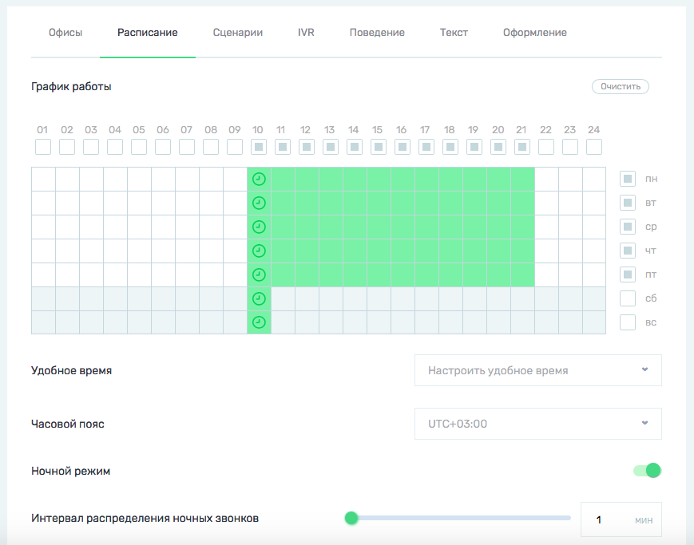

# Виджет обратного звонка на ckct

#### Примечание:
`Инструмент доступен только для аккаунтов, перенесенных с callkeeper.ru/callkeeper.com`
________

Перейдите в раздел Приложения. Здесь вы можете создавать инструменты для получения звонков и лидов.

Нажмите "Добавить виджет". 

Введите название нового виджета и сайт, для которого вы создаете этот виджет. Оба поля носят информативный характер, вы сможете отредактировать их позже. 

Обратите внимание на поле "Для кого сохранить виджет". По умолчанию вы можете создавать инструмент только для себя - для аккаунта, под которым вы залогинились. Если вам выдадут роль на создание инструмента другому пользователю, то в этом списке кроме вашего аккаунта появится список аккаунтов, для которых вы можете создавать инструменты по роли.

Выберите, для какого аккаунта вы создаете виджет и нажмите Сохранить.

Вы перейдете на страницу настроек виджета.

### Настройки виджета
#### Офисы

Прикрепите к виджету минимум один офис. Список офисов автоматических подгружается из номеров офисов. [Подробнее здесь](/documentation/calltracking/calltracking_instruction.md#Добавление-офисов).

Вы можете нажать на стрелку справа от выбранного офиса и настроить отправку уведомлений.

Нажмите "+ Добавить уведомление".

Введите email, на который будут отправляться уведомления, и типы звонков, по которым они будут отправляться.

Например, при каждом неуспешном звонке на указанный номер офиса на почту email@email.com будет приходить уведомление о неуспешном звонке.

Вы можете добавить несколько email для отправки уведомления по разным типам звонков и в любой момент удалить ненужные, нажав на крестик рядом с почтой.

#### Расписание

Следующий шаг - настройка расписания работы виджета.
В таблице отметьте зеленым часы работы вашего офиса. В эти часы будут проходить звонки, заказанные с виджета и с прикрепленных к нему инструментов.

`Удобное время - это время, в которое поступит звонок, заказанный в нерабочее время. По умолчанию отображается на виджете, если пользователь выберет опцию: перезвоните мне в удобное время.`

Выберите удобное время для нужных дней недели.

Удобное время автоматически появится в таблице расписания в виде зеленой клетки с часами.

`Часовой пояс - часовой пояс, к которому будет привязано рабочее время виджета.`

`Ночной режим - если вы хотите, чтобы в нерабочее время клиенты не видели ваши инструменты на сайте, оставьте настройку неактивной. Если ночной режим включен, то в нерабочее время клиенты увидят инструмент с ночным текстом (настраивается здесь) и смогут заказать отложенный звонок.`

`Интервал распределения ночных звонков - интервал, с которым состоятся звонки, запланированные на одно и то же время. Не рекомендуется ставить интервал больше 10 минут.`

В календаре праздничных дней вы можете выбрать праздничные дни и специальный текст, который будет отображаться только в этот день. 
Вы также можете сделать день рабочим, настроим рабочие часы при выборе праздничного дня или отредактировав его позже в строках под календарем. 

Все созданные инструменты (виджеты и лидогенераторы) будут отображаться в разделе Приложения.

